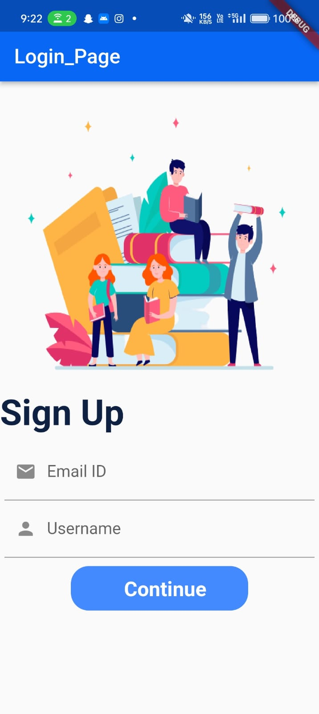

# 🎯 Quiz App - Flutter Project

Welcome to my **first Flutter project** – a colorful and interactive **Quiz App**. This app allows users to sign up, log in, view their profile with game stats, and test their knowledge through a fun quiz interface.

---

## 📱 App Screens Overview

### 🔐 Login Page
> Allows users to log in using their email ID and password or via Google.  
(*Login screen image intentionally excluded as per request.*)

---

### 📝 Sign Up Page
> New users can create an account by providing an email ID and username.

---

### 👤 Profile / Welcome Page
> Displays user's avatar, name, balance, rank, and remaining lives. This is the screen users see after login.

---

### ❓ Quiz Page
> Displays a question and multiple-choice answers. Includes a progress bar for quiz tracking.

---

## 🛠️ Features

- Email & Google Authentication
- Profile screen with user stats (balance, rank, lives)
- Clean and colorful animated UI
- Quiz questions with multiple choice answers
- Smooth navigation between login → profile → quiz

---

